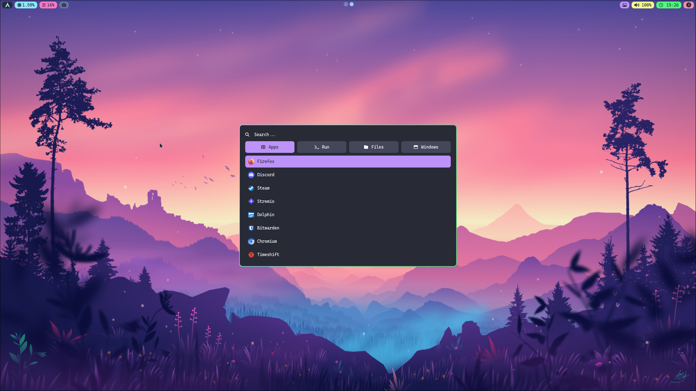
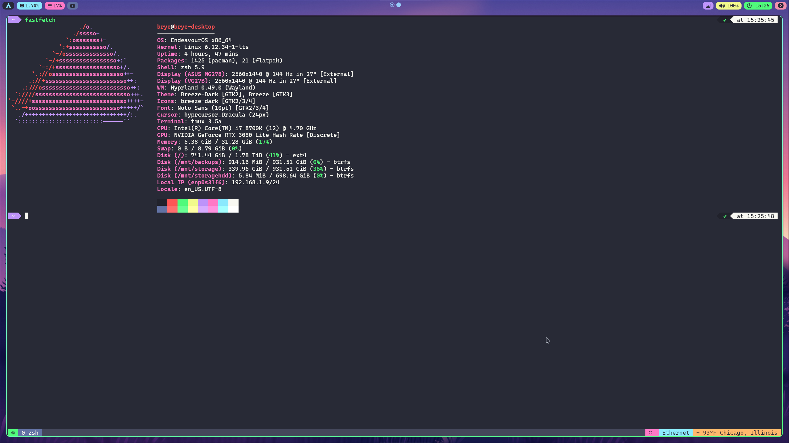

# Dotfiles Setup

These dotfiles help you quickly configure your development environment on a Arch based Linux machine.

## Clone the Repository

Clone this repository **with submodules** to ensure all dependencies (such as plugin managers) are included:

```sh
git clone --recurse-submodules https://github.com/bryewalks/dotfiles.git ~/dotfiles
```
```
cd ~/dotfiles
```
> **Note:** The `--recurse-submodules` flag ensures any git submodules are also cloned.


## Automatic Hyprland Installation

A script is provided to automate the inital setup process for Hyprland and dotfiles:

** Warning: This script should only be used for a fresh install or systems that were previously configured with these dotfiles. It will overwrite existing configurations. **

```sh
./install.sh
```

Ask before proceeding with each step.
```sh
./install.sh --confirm
```

This script will automatically install necessary plugins for hyprland and unstow all available configurations.

## Notes

- Review the contents of `install.sh` before running.
- Existing dotfiles may be overwritten. Backup if necessary.
- Additional packages can be installed by modifying OFFICIAL_PACKAGES (pacman) or AUR_PACKAGES (yay) in `install.sh`.

## Manual Installation with Stow

### Prerequisites

- GNU Stow (`sudo pacman -S stow`)


Each directory (e.g., `nvim`, `zsh`, `tmux`) corresponds to a set of dotfiles.

To symlink the specific configuration(s) into your home directory, run:

```sh
stow nvim
stow zsh
stow tmux
```

Or symlink all at once:

```sh
stow */
```

## Uninstall

To remove symlinks created by stow:

```sh
stow -D nvim
stow -D zsh
stow -D tmux
```

## Screenshots
  
  
